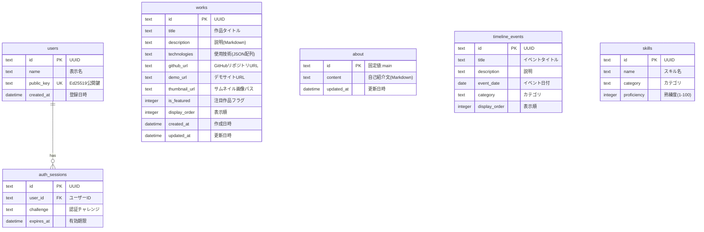

# Dice's Portfolio - 完全設計書

## 目次

1. [プロジェクト概要](#1-プロジェクト概要)
2. [画面設計](#2-画面設計)
3. [機能設計](#3-機能設計)
4. [API設計](#4-api設計)
5. [データベース設計](#5-データベース設計)
6. [バックアップ・運用](#6-バックアップ運用)
7. [ディレクトリ構成](#7-ディレクトリ構成)
8. [実装タスク一覧](#8-実装タスク一覧)

---

## 1. プロジェクト概要

### 1.1 サイト名
**Dice's Portfolio**

### 1.2 目的
- 自分の作品（プロダクト）を魅力的に紹介する
- スキル・経歴を視覚的に伝える
- 採用担当者・クライアントへのアピール

### 1.3 対象ユーザー
| ユーザー種別 | 目的 |
|-------------|------|
| 採用担当者 | スキル・実績の確認 |
| クライアント | 依頼可能な技術の確認 |
| 同業者 | 技術交流・コラボレーション |
| 自分自身 | 作品管理・編集 |

### 1.4 主要機能
- 作品（Works）の一覧・詳細表示
- 自己紹介（About）ページ
- タイムライン（経歴）表示
- **モダンなUI/UX**: ガラスモーフィズムやスムーズなアニメーションを用いた洗練されたデザイン
- **インタラクティブ演出**: CSSアニメーションやFramer Motionを活用した、視覚的に心地よいインタラクション
- **Web Markdown Editor**: ブラウザ上でMarkdownを直接記述・プレビューし、Markdownファイルのアップロードにも対応

### 1.5 開発プロセス（AIガイド方式・学習モード）
本プロジェクトは、GoやNext.jsの初学者であるユーザーの学習効果を最大化するため、以下のプロセスで開発を進める。
1. **AIからの問題提示**: AIからは全コードを提供するのではなく、「どこにどのような処理を書くべきか」をヒント付きの問題形式でガイドする。
2. **ユーザーによる実装**: ユーザーがヒントをもとにコードを書く。
3. **レビューと答え合わせ**: ユーザーが書き終えたら、AIがコードをレビュー・添削し、正解コードやベストプラクティスを提示してから次のステップに進む。
4. **作業ログの記録**: 実装の各ステップにおいて、AIが作業ログ（何を変更しなぜそうしたかに加え、**ユーザーからの指摘、修正点、発生したエラーとその解決策**）を `CHANGELOG.md` に詳細に記録していく。
5. **継続的な改善**: 実装後のリファクタリングや機能追加も、同プロセスで進める。

### 1.6 使用技術

| カテゴリ | 技術 | 選定理由 |
|----------|------|------|
| バックエンド | Go (Gin) | N100の限られたリソースでも高いスループットを発揮。`net/http` 互換のAPIで学習済み知識を活かしやすく、ミドルウェアのエコシステムが充実している |
| フロントエンド | Next.js, React, TypeScript | SSG/ISRによる静的生成でN100のCPU負荷を軽減しつつ、動的なページも構築可能 |
| スタイリング | Tailwind CSS + Shadcn UI | ガラスモーフィズム等のモダンなUI構築に利用 |
| データベース | SQLite | 外部DBサーバー不要で自宅環境に最適。単一ファイルのためバックアップも容易 |
| アニメーション | Framer Motion | スムーズなインタラクションを実現 |
| デザイン | CSS Gradients / Glassmorphism | モダンで高級感のある質感を演出 |
| 認証 | Ed25519, JWT | 公開鍵暗号の学習経験を活かした自前実装 |
| インフラ | N100 Mini PC + Cloudflare Tunnel | 自宅サーバーでの運用、SSL/CDNはCloudflareで自動化 |

---

## 2. 画面設計

### 2.1 画面一覧

| No | 画面名 | パス | 認証 | 説明 |
|----|--------|------|------|------|
| 1 | トップページ | `/` | 不要 | Hero + 注目作品 + 自己紹介概要 |
| 2 | 作品一覧 | `/works` | 不要 | 全作品のグリッド表示 |
| 3 | 作品詳細 | `/works/[id]` | 不要 | 作品の詳細情報 |
| 4 | About | `/about` | 不要 | 自己紹介・スキル・タイムライン |
| 5 | Contact | `/contact` | 不要 | 連絡先・SNSリンク |
| 6 | 管理画面 | `/admin` | 必要 | コンテンツ編集 |

### 2.2 共通要素

#### ヘッダー
| 要素 | 仕様 |
|------|------|
| ロゴ | サイトネームロゴ、クリックでトップへ |
| ナビゲーション | Works, About, Contact へのリンク |
| ARボタン | XR対応デバイスでのみ表示、ARモード切替 |
| テーマ切替 | ライト/ダークモードの切り替え |

#### フッター
| 要素 | 仕様 |
|------|------|
| SNSリンク | GitHub, Twitter, LinkedInアイコン |
| コピーライト | 年号 + サイト名 |

### 2.3 各画面の構成要素

#### トップページ (`/`)
| セクション | 内容 |
|------------|------|
| Hero | タイトル、キャッチコピー、CTAボタン、背景のモダンな装飾エフェクト |
| Featured Works | 注目作品3件のカード表示 |
| About プレビュー | プロフィール写真 + 短い自己紹介文 |

#### 作品一覧 (`/works`)
| 要素 | 仕様 |
|------|------|
| フィルター | 技術タグでフィルタリング（All, Go, TypeScript等） |
| 作品カード | サムネイル, タイトル, 技術タグ, クリックで詳細へ |

#### 作品詳細 (`/works/[id]`)
| 要素 | 仕様 |
|------|------|
| メイン画像 | 大きなサムネイル |
| タイトル | 作品名（h1） |
| 技術タグ | 使用技術一覧 |
| 説明文 | Markdownをレンダリング |
| リンク | GitHub, Demo ボタン |

#### About (`/about`)
| セクション | 内容 |
|------------|------|
| プロフィール | 写真、名前、自己紹介文 |
| Skills | スキルチャート（レーダーチャート or バー） |
| Timeline | 縦のタイムライン（教育/仕事/プロジェクト別に色分け） |

#### Contact (`/contact`)
| 要素 | 仕様 |
|------|------|
| 連絡先 | Email（mailto:リンク） |
| SNS | GitHub, Twitter, LinkedIn へのリンク |

#### 管理画面 (`/admin`)
| 要素 | 仕様 |
|------|------|
| 認証 | 公開鍵認証によるログイン |
| サイドバー | Works, About, Timeline, Skills の切替 |
| Markdownエディタ | リアルタイムプレビュー付きのMarkdown編集UI |
| ファイルアップロード | `.md` ファイルの直接アップロードによるコンテンツ更新 |

### 2.4 レスポンシブ対応

| 名称 | 幅 | 変更点 |
|------|-----|------|
| Mobile | 〜767px | ハンバーガーメニュー、作品カード1列 |
| Tablet | 768px〜1023px | 作品カード2列 |
| Desktop | 1024px〜 | 作品カード3列 |

### 2.5 エラー・エンプティステート

| 画面状態 | 発生条件 | UI仕様 |
|--------|------------|------|
| **404 Not Found** | 存在しないURLへのアクセス | 「ページが見つかりません」というメッセージと、トップへの誘導ボタン |
| **500 Server Error** | APIやサーバーでの予期せぬエラー | 「サーバーエラーが発生しました」というメッセージと、リロードボタン |
| **Empty State** | DBにまだデータが存在しない場合 | 「まだ作品がありません」など、視覚的に寂しくならないモダンなプレースホルダーUI |

---

## 3. 機能設計

### 3.1 公開機能（閲覧者向け）

#### 作品表示
| 機能 | 仕様 |
|------|------|
| 一覧取得 | `display_order` 順に表示 |
| 注目作品 | `is_featured=true` を優先表示 |
| 技術フィルター | 技術タグでフィルタリング（OR条件） |
| Markdown | `description` をHTMLにレンダリング |

#### スキルチャート
| 機能 | 仕様 |
|------|------|
| 表示形式 | レーダーチャート |
| カテゴリ分け | 言語, フレームワーク, ツール |
| 熟練度 | 1-100 を視覚的に表示 |

#### タイムライン
| 機能 | 仕様 |
|------|------|
| 表示順 | `event_date` 降順（新しい順） |
| カテゴリ | education, work, project で色分け |

#### ビジュアル演出
- **Glassmorphism**: 半透明の背景とぼかしを多用し、奥行き感を演出。
- **Smooth Interaction**: スクロールに応じたフェードインや、ホバー時の滑らかな変形演出。

### 3.2 アニメーション・UI演出
- **Aurora Background**: CSSのグラデーションと `animate` を組み合わせた、流動的な背景演出。
- **Entorance Animation**: ページ遷移や要素の表示時に、Framer Motion を用いて吸い付くようなフェードインを実装。
- **Hover Effects**: カードやリンクに対して、スカラー（拡大）やネオン風の発光効果を付与。

### 3.3 認証機能（公開鍵認証）

#### 認証方式
| 項目 | 仕様 |
|------|------|
| アルゴリズム | Ed25519 |
| チャレンジ | ランダム32バイト（Base64）、有効期限5分 |
| JWT | 有効期限1時間 |
| 秘密鍵の管理 | ローカルの秘密鍵ファイルを、ログイン時にブラウザの管理画面から読み込ませる「ファイルインポート方式」を採用。ブラウザのストレージには一切保存しない。 |

#### 認証フロー
1. **初回設定**: 事前に提供のスクリプト（`generate-keys.sh`）で鍵ペアを生成し、公開鍵をサーバー環境変数 `ADMIN_PUBLIC_KEY` に設定。
2. **初回登録**: 管理画面で公開鍵をAPIに送信 → 環境変数と一致する場合のみデータベースに管理者として登録。
3. **ログイン**:
   - サーバーから使い捨てのチャレンジ文字列を取得
   - 管理画面にローカルの秘密鍵ファイルを読み込ませる（※サーバーには非送信、ブラウザのメモリ内処理）
   - Web Crypto API で秘密鍵をインポートし、チャレンジに署名
   - 署名をサーバーに送信して検証 → JWT発行
4. **編集操作**: リクエストヘッダーにJWTパラメーターを付与 → 検証 → 処理実行

### 3.4 コンテンツ管理（Web Editor）

#### 編集機能
| 対象 | 操作 |
|------|------|
| Works | 一覧表示, 追加, 編集, 削除, 並び替え |
| About | 内容編集（Markdown） |
| Timeline | 追加, 編集, 削除 |
| Skills | 追加, 編集, 削除, 熟練度変更 |

#### Markdown対応
| 機能 | 仕様 |
|------|------|
| リアルタイムプレビュー | 左右分割で編集とプレビューを同時表示 |
| Markdownファイルアップロード | `.md` ファイルをドラッグ&ドロップまたは選択でインポート |
| 画像アップロード | N100リソース保護のため、**サイズ上限2MB**、拡張子は `.jpg, .png, .webp` に制限。可能であれば保存時に自動で `.webp` 変換を行う |

### 3.5 ロギング・エラーハンドリング
- **バックエンドロギング**: 標準の `log/slog` を使用し、構造化ログを出力。
- **エラーレスポンス**: 一貫したJSONフォーマット（`4.3 共通仕様`参照）でクライアントに通知。
- **フロントエンド監視**: APIエラー発生時にトースト通知でユーザーにフィードバック。

### 3.6 バックエンド詳細設計
- **Middleware**: Ginの標準ミドルウェア（Logger, Recovery, CORS）に加え、Auth（JWT検証）を独自実装。
- **Database Migration**: `backend/migrations` 下のSQLファイルを起動時に自動、または `Makefile` 経由で手動実行する仕組み。
- **Validation**: `go-playground/validator` を用い、構造体のタグベースでリクエストを検証。

### 3.7 セキュリティ対策（XSS・DDoS・リソース保護）
- **XSS (クロスサイトスクリプティング) 対策**:
  - **フロントエンド**: Markdownをレンダリングする際、`DOMPurify` 等のライブラリを用いて不正な `<script>` タグやイベントを無害化する。
  - **バックエンド**: Goの `bluemonday` パッケージ等を用い、DBに保存する前にHTMLをサニタイズする。
- **Rate Limit（DDoS対策）**:
  - Ginのミドルウェアを使用し、同一IPからの短時間のリクエスト数（特に `/auth` やアップロードAPI）を制限してサーバー（N100）ダウンを防ぐ。

---

## 4. API設計

### 4.1 エンドポイント一覧

#### 公開API（認証不要）
| Method | Endpoint | 説明 |
|--------|----------|------|
| GET | `/api/health` | ヘルスチェック（サーバー正常稼働確認用） |
| GET | `/api/works` | 作品一覧取得 |
| GET | `/api/works/:id` | 作品詳細取得 |
| GET | `/api/about` | About情報取得 |
| GET | `/api/timeline` | タイムライン取得 |
| GET | `/api/skills` | スキル一覧取得 |

#### 認証API
| Method | Endpoint | 説明 |
|--------|----------|------|
| GET | `/auth/challenge` | 認証チャレンジ取得 |
| POST | `/auth/verify` | 署名検証・JWT発行 |
| POST | `/auth/register` | 公開鍵登録（初回のみ） |

#### 管理API（認証必要）
| Method | Endpoint | 説明 |
|--------|----------|------|
| POST | `/api/works` | 作品追加 |
| PUT | `/api/works/:id` | 作品編集 |
| DELETE | `/api/works/:id` | 作品削除 |
| PUT | `/api/about` | About編集 |
| POST | `/api/timeline` | タイムラインイベント追加 |
| PUT | `/api/timeline/:id` | タイムラインイベント編集 |
| DELETE | `/api/timeline/:id` | タイムラインイベント削除 |
| POST | `/api/skills` | スキル追加 |
| PUT | `/api/skills/:id` | スキル編集 |
| DELETE | `/api/skills/:id` | スキル削除 |

### 4.2 レスポンス例

#### GET /api/works
```json
{
  "featured": [
    {
      "id": "uuid-1",
      "title": "Google Drive CUI Bot",
      "description": "Discord上でGoogle Driveを操作できるBot",
      "technologies": ["Go", "Discord API", "SQLite"],
      "github_url": "https://github.com/username/gdrive-bot",
      "demo_url": null,
      "thumbnail_url": "/images/works/gdrive-bot.png",
      "is_featured": true,
      "display_order": 1,
      "created_at": "2025-12-01T00:00:00Z",
      "updated_at": "2025-12-15T00:00:00Z"
    }
  ],
  "others": [...]
}
```

#### GET /api/works/:id
```json
{
  "id": "uuid-1",
  "title": "Google Drive CUI Bot",
  "description": "## 概要\nDiscord上でGoogle Driveを...",
  "technologies": ["Go", "Discord API", "SQLite"],
  "github_url": "https://github.com/username/gdrive-bot",
  "demo_url": null,
  "thumbnail_url": "/images/works/gdrive-bot.png",
  "is_featured": true,
  "display_order": 1,
  "created_at": "2025-12-01T00:00:00Z",
  "updated_at": "2025-12-15T00:00:00Z"
}
```

#### GET /api/about
```json
{
  "id": "main",
  "content": "## 自己紹介\n私は...",
  "updated_at": "2026-01-01T00:00:00Z"
}
```

#### GET /api/timeline
```json
{
  "events": [
    {
      "id": "uuid-t1",
      "title": "ポートフォリオ作成",
      "description": "Go + Next.jsでポートフォリオサイトを作成",
      "event_date": "2026-01-01",
      "category": "project",
      "display_order": 1
    }
  ]
}
```

#### GET /api/skills
```json
{
  "skills": [
    {
      "id": "uuid-s1",
      "name": "Go",
      "category": "language",
      "proficiency": 80
    }
  ]
}
```

#### GET /auth/challenge
```json
{
  "challenge": "base64-encoded-random-32-bytes",
  "expires_at": "2026-02-08T12:05:00Z"
}
```

#### POST /auth/verify
リクエスト:
```json
{
  "public_key": "base64-encoded-public-key",
  "signature": "base64-encoded-signature",
  "challenge": "base64-encoded-challenge"
}
```
レスポンス:
```json
{
  "token": "eyJhbGciOiJIUzI1NiIs...",
  "expires_at": "2026-02-08T13:00:00Z",
  "user": {
    "id": "uuid-u1",
    "name": "Dice"
  }
}
```

#### POST /auth/register
リクエスト:
```json
{
  "public_key": "base64-encoded-public-key",
  "name": "Dice"
}
```
レスポンス:
```json
{
  "id": "uuid-u1",
  "name": "Dice",
  "created_at": "2026-02-08T12:00:00Z"
}
```

### 4.3 共通仕様

#### 認証ヘッダー（管理API）
```
Authorization: Bearer <JWT_TOKEN>
```

#### エラーレスポンス
```json
{
  "error": {
    "code": "NOT_FOUND",
    "message": "指定されたリソースが見つかりません"
  }
}
```

#### HTTPステータスコード
| コード | 説明 |
|--------|------|
| 200 | 成功 |
| 201 | 作成成功 |
| 400 | リクエストエラー |
| 401 | 認証エラー |
| 404 | リソース未発見 |
| 500 | サーバーエラー |

---

## 5. データベース設計

> **注記**: Discord/Notion連携は廃止し、コンテンツ管理はWeb Editorに一本化した。

### 5.1 ER図



### 5.2 テーブル定義

#### users（ユーザー）
| カラム名 | 型 | NULL | 説明 |
|----------|-----|------|------|
| id | TEXT | NO | UUID、主キー |
| name | TEXT | NO | 表示名 |
| public_key | TEXT | NO | Ed25519公開鍵（Base64）、ユニーク |
| created_at | DATETIME | NO | 登録日時 |

#### auth_sessions（認証セッション）
| カラム名 | 型 | NULL | 説明 |
|----------|-----|------|------|
| id | TEXT | NO | UUID、主キー |
| user_id | TEXT | NO | ユーザーID（外部キー） |
| challenge | TEXT | NO | 認証チャレンジ（Base64） |
| expires_at | DATETIME | NO | 有効期限 |

#### works（作品）
| カラム名 | 型 | NULL | 説明 |
|----------|-----|------|------|
| id | TEXT | NO | UUID、主キー |
| title | TEXT | NO | 作品タイトル |
| description | TEXT | NO | 説明（Markdown） |
| technologies | TEXT | NO | 使用技術（JSON配列） |
| github_url | TEXT | YES | GitHubリポジトリURL |
| demo_url | TEXT | YES | デモサイトURL |
| thumbnail_url | TEXT | YES | サムネイル画像パス |
| is_featured | INTEGER | NO | 注目作品フラグ（0/1） |
| display_order | INTEGER | NO | 表示順 |
| created_at | DATETIME | NO | 作成日時 |
| updated_at | DATETIME | NO | 更新日時 |

#### about（自己紹介）
| カラム名 | 型 | NULL | 説明 |
|----------|-----|------|------|
| id | TEXT | NO | 固定値 'main' |
| content | TEXT | NO | 自己紹介文（Markdown） |
| updated_at | DATETIME | NO | 更新日時 |

#### timeline_events（タイムライン）
| カラム名 | 型 | NULL | 説明 |
|----------|-----|------|------|
| id | TEXT | NO | UUID、主キー |
| title | TEXT | NO | イベントタイトル |
| description | TEXT | YES | 説明 |
| event_date | DATE | NO | イベント日付 |
| category | TEXT | NO | カテゴリ（education/work/project） |
| display_order | INTEGER | NO | 表示順 |

#### skills（スキル）
| カラム名 | 型 | NULL | 説明 |
|----------|-----|------|------|
| id | TEXT | NO | UUID、主キー |
| name | TEXT | NO | スキル名 |
| category | TEXT | NO | カテゴリ（language/framework/tool） |
| proficiency | INTEGER | NO | 熟練度（1-100） |

### 5.3 追加仕様・最適化
- **外部キー制約**: `PRAGMA foreign_keys = ON;` を有効化。
- **インデックス**: 検索頻度の高い `featured` や `event_date` に付与。
- **画像管理**: 画像は `/public/images` 下に配置し、パスをDBに保存。

### 5.4 マイグレーションSQL

```sql
-- 外部キー制約を有効化
PRAGMA foreign_keys = ON;

-- ユーザーテーブル
CREATE TABLE users (
    id TEXT PRIMARY KEY,
    name TEXT NOT NULL,
    public_key TEXT NOT NULL UNIQUE,
    created_at DATETIME DEFAULT CURRENT_TIMESTAMP
);

-- 認証セッションテーブル
CREATE TABLE auth_sessions (
    id TEXT PRIMARY KEY,
    user_id TEXT NOT NULL,
    challenge TEXT NOT NULL,
    expires_at DATETIME NOT NULL,
    FOREIGN KEY (user_id) REFERENCES users(id)
);

-- 作品テーブル
CREATE TABLE works (
    id TEXT PRIMARY KEY,
    title TEXT NOT NULL,
    description TEXT NOT NULL,
    technologies TEXT NOT NULL,
    github_url TEXT,
    demo_url TEXT,
    thumbnail_url TEXT,
    is_featured INTEGER DEFAULT 0,
    display_order INTEGER DEFAULT 0,
    created_at DATETIME DEFAULT CURRENT_TIMESTAMP,
    updated_at DATETIME DEFAULT CURRENT_TIMESTAMP
);

-- Aboutテーブル
CREATE TABLE about (
    id TEXT PRIMARY KEY DEFAULT 'main',
    content TEXT NOT NULL,
    updated_at DATETIME DEFAULT CURRENT_TIMESTAMP
);

-- タイムラインテーブル
CREATE TABLE timeline_events (
    id TEXT PRIMARY KEY,
    title TEXT NOT NULL,
    description TEXT,
    event_date DATE NOT NULL,
    category TEXT NOT NULL,
    display_order INTEGER DEFAULT 0
);

-- スキルテーブル
CREATE TABLE skills (
    id TEXT PRIMARY KEY,
    name TEXT NOT NULL,
    category TEXT NOT NULL,
    proficiency INTEGER DEFAULT 50
);

-- インデックス
CREATE INDEX idx_works_featured ON works(is_featured);
CREATE INDEX idx_timeline_date ON timeline_events(event_date);
```

### 5.4 初期データ

```sql
-- About
INSERT INTO about (id, content) VALUES (
    'main',
    '## 自己紹介

こんにちは、Diceです。
プログラミングが好きで、様々なプロジェクトに取り組んでいます。'
);

-- Skills
INSERT INTO skills (id, name, category, proficiency) VALUES
    ('skill-go', 'Go', 'language', 80),
    ('skill-ts', 'TypeScript', 'language', 75),
    ('skill-python', 'Python', 'language', 70),
    ('skill-react', 'React', 'framework', 70),
    ('skill-nextjs', 'Next.js', 'framework', 65),
    ('skill-docker', 'Docker', 'tool', 60),
    ('skill-git', 'Git', 'tool', 80);

-- Timeline
INSERT INTO timeline_events (id, title, description, event_date, category, display_order) VALUES
    ('tl-1', 'ポートフォリオ作成開始', 'Go + Next.jsでポートフォリオサイトを作成', '2026-01-01', 'project', 1);
```

---

## 6. バックアップ・運用

### 6.1 データバックアップ戦略
| 項目 | 方針 |
|------|------|
| 対象 | SQLiteデータベースファイル (`data/portfolio.db`) + アップロード画像 (`frontend/public/images/`) |
| 方法 | GitHub Actions の `schedule` トリガーで定期的にバックアップスクリプトを実行 |
| 保存先 | GitHub Releases または S3互換ストレージ（Cloudflare R2等）へ暗号化して保存 |
| 頻度 | 日次（毎日深夜に実行） |
| 世代管理 | 直近7日分を保持、7日以上前の古いバックアップは自動削除 |

### 6.2 障害対応
| 障害 | 対応 |
|------|------|
| N100 停電・再起動 | Docker `restart: unless-stopped` で自動復旧、Cloudflare Tunnel も systemd で自動起動 |
| 回線断 | Cloudflare側で503ページを表示。回線復旧後に自動再接続 |
| DBファイル破損 | 最新のバックアップからリストア。手順を `scripts/restore.sh` に用意 |

---

## 7. ディレクトリ構成

```
my_portfolio/
├── .github/
│   └── workflows/
│       ├── ci.yml                    # CI（テスト・リント）
│       └── backup.yml                # 定期バックアップ
├── docker/
│   ├── Dockerfile.backend            # Goバックエンド用
│   └── Dockerfile.frontend           # Next.jsフロントエンド用
├── docker-compose.yml                # 開発環境コンテナ定義
├── backend/
│   ├── cmd/server/main.go            # エントリーポイント
│   ├── internal/
│   │   ├── auth/                     # 認証関連
│   │   ├── handler/                  # APIハンドラー
│   │   ├── model/                    # データモデル
│   │   ├── repository/               # DB操作
│   │   └── middleware/               # ミドルウェア
│   ├── migrations/001_init.sql       # 初期テーブル作成
│   ├── go.mod
│   └── Makefile
├── frontend/
│   ├── app/                          # ページ
│   ├── components/                   # コンポーネント
│   ├── hooks/                        # カスタムフック
│   ├── lib/                          # ユーティリティ
│   ├── styles/                       # CSS
│   ├── public/                       # 静的ファイル
│   ├── next.config.js
│   └── package.json
├── docs/
│   ├── DESIGN.md                     # 設計書（本ファイル）
│   └── CHANGELOG.md                  # AI作業ログ
├── scripts/
│   ├── setup.sh                      # 初期セットアップ
│   ├── seed.sh                       # 初期データ投入
│   ├── generate-keys.sh              # キーペア生成
│   └── restore.sh                    # バックアップからの復元
├── infrastructure/                   # インフラ設定
│   ├── cloudflared/                  # Cloudflare Tunnel設定
│   └── docker-compose.yml            # 自宅PC展開用
├── data/                             # SQLiteファイル格納
├── .gitignore
├── README.md
├── LICENSE
└── Makefile
```

---

## 8. 実装タスク一覧

### Phase 1: 基盤構築（Week 1）
- [ ] Docker環境構築（Dockerfile, docker-compose.yml）
- [ ] Goプロジェクト（Gin）初期化
- [ ] Next.jsプロジェクト初期化
- [ ] SQLite接続・マイグレーション実装
- [ ] 基本API実装（GET /works, /about, /timeline, /skills）
- [ ] GitHub Actions バックアップワークフロー設定

### Phase 2: フロントエンド基本（Week 2）
- [ ] デザインモックアップ作成・選択
- [ ] 共通コンポーネント（Header, Footer, Button, Card）
- [ ] エラー・エンプティステートコンポーネント（404, 500, 空データ時）
- [ ] トップページ（Hero, Featured Works, About プレビュー）
- [ ] 作品一覧・詳細ページ
- [ ] About ページ（スキルチャート, タイムライン）
- [ ] Contact ページ
- [ ] レスポンシブ対応・ダークモード

### Phase 3: 認証・編集機能（Week 3）
- [ ] Ed25519公開鍵認証実装
- [ ] JWT発行・検証
- [ ] 認証API（challenge, verify, register）
- [ ] 管理API（CRUD操作）
- [ ] キーペア生成スクリプト

### Phase 4: Web Markdown Editor（Week 4）
- [ ] Markdownエディタ（リアルタイムプレビュー付き）
- [ ] Markdownファイルアップロード機能
- [ ] 画像アップロード機能（上限2MB・拡張子制限）
- [ ] セキュリティ対応（XSSサニタイズ、Rate Limit）
- [ ] 管理画面UI統合

### Phase 5: UI/UX 刷新（Week 5-6）
- [ ] タイポグラフィとカラーパレットの最終調整
- [ ] オーロラグラデーション背景の実装
- [ ] Framer Motion による詳細なインタラクション実装
- [ ] レスポンシブ表示の徹底的なブラッシュアップ
- [ ] 全体のビジュアル一貫性の確認

### Phase 6: ブラッシュアップ・デプロイ（Week 7）
- [ ] 全機能テスト（Unit/E2E）
- [ ] パフォーマンス最適化・SEO対応（メタタグ, OGP）
- [ ] 作業ログの最終まとめ
- [ ] ドキュメント整備
- [ ] N100 + Cloudflare Tunnel での本番デプロイ
